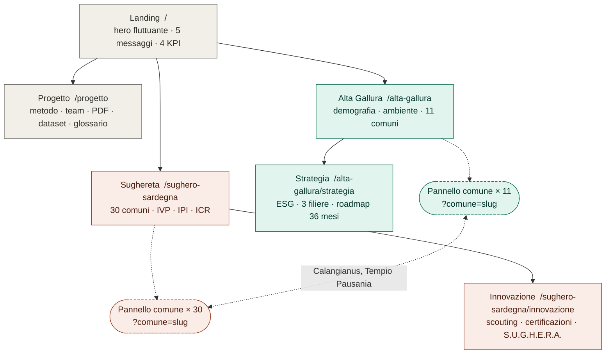

# Sitemap del mini-sito

6 pagine. Le schede comune (11 + 30) si aprono in un pannello laterale con URL `?comune=slug`, non sono pagine.

File di contenuto (`pagine/`):

| Pagina | File |
|---|---|
| `/` | `00-landing.md` |
| `/progetto` | `01-progetto.md` |
| `/alta-gallura` | `02-alta-gallura.md` + pannello `02b-alta-gallura-pannello-comune.md` |
| `/alta-gallura/strategia` | `03-alta-gallura-strategia.md` |
| `/sughero-sardegna` | `04-sughero-sardegna.md` + pannello `04b-sughero-pannello-comune.md` |
| `/sughero-sardegna/innovazione` | `05-sughero-innovazione.md` |

Title e description SEO sono nel frontmatter di ogni file. Versioni precedenti in `_archivio/`.
